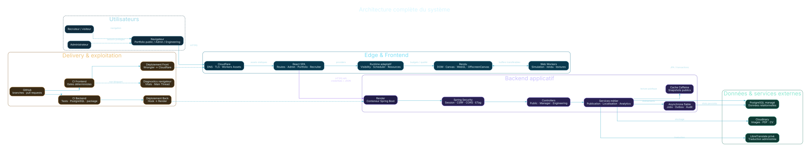
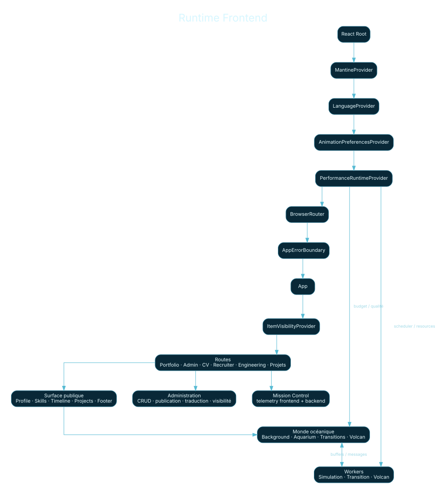
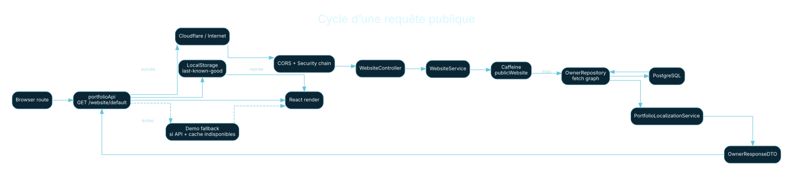
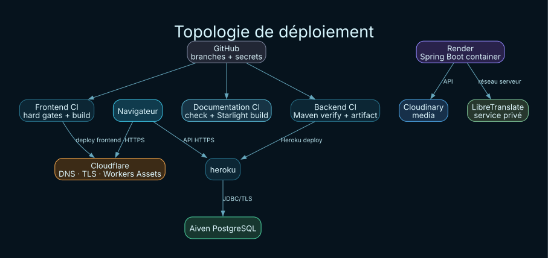

<div align="center">

# Professional Website · Frontend

**React · Vite · Mantine · GSAP · Web Workers · OffscreenCanvas · Cloudflare**

Interface publique, administration, runtime visuel adaptatif, observabilité navigateur et intégration avec l’API Spring Boot.

[Documentation Frontend](documentation/src/content/docs/frontend/architecture.md) · [Architecture globale](documentation/src/content/docs/overview/system-architecture.md) · [Front ↔ Back](documentation/src/content/docs/integration/front-back.md) · [Cloud](documentation/src/content/docs/cloud/topology.md) · [Déploiement](documentation/src/content/docs/deployment/full-release.md)

</div>

---

## Atlas du système

<p align="center">
  
</p>

Le dépôt frontend est une partie d’un système full stack à deux dépôts. Le navigateur charge l’application distribuée par Cloudflare, consomme l’API Spring Boot, affiche le contenu public, fournit l’administration authentifiée et adapte le rendu visuel aux capacités du terminal. Les données métier restent sous autorité du backend et de PostgreSQL.

**Dépôt complémentaire :** [professional_website — Backend Spring Boot](https://github.com/idris-ach2002/professional_website)

---

## Méga-menu technique

| Domaine | Entrée principale | Détails |
|---|---|---|
| **Vue système** | [Vue d’ensemble](documentation/src/content/docs/overview/system-overview.md) | [Architecture](documentation/src/content/docs/overview/system-architecture.md) · [Atlas des diagrammes](documentation/src/content/docs/overview/diagram-atlas.md) · [Carte du dépôt](documentation/src/content/docs/overview/repository-map.md) |
| **Frontend** | [Architecture React](documentation/src/content/docs/frontend/architecture.md) | [Routes](documentation/src/content/docs/frontend/routes-and-pages.md) · [Données publiques](documentation/src/content/docs/frontend/public-data-flow.md) · [Admin](documentation/src/content/docs/frontend/admin-console.md) |
| **Runtime visuel** | [Ocean runtime](documentation/src/content/docs/frontend/ocean-runtime.md) | [Timeline](documentation/src/content/docs/frontend/timeline.md) · [Workers et rendu](documentation/src/content/docs/frontend/workers-and-rendering.md) · [Performance runtime](documentation/src/content/docs/frontend/performance-runtime.md) |
| **Intégration** | [Front ↔ Back](documentation/src/content/docs/integration/front-back.md) | [Auth / CSRF / CORS](documentation/src/content/docs/integration/auth-csrf-cors.md) · [Cycle public](documentation/src/content/docs/integration/public-data-lifecycle.md) · [Résilience](documentation/src/content/docs/integration/resilience-cache.md) |
| **Cloud** | [Topologie](documentation/src/content/docs/cloud/topology.md) | [Cloudflare](documentation/src/content/docs/cloud/cloudflare.md) · [Render](documentation/src/content/docs/cloud/render.md) · [Données & médias](documentation/src/content/docs/cloud/data-and-media.md) |
| **Déploiement** | [Release complète](documentation/src/content/docs/deployment/full-release.md) | [Développement local](documentation/src/content/docs/deployment/local-development.md) · [Frontend](documentation/src/content/docs/deployment/frontend.md) · [Rollback](documentation/src/content/docs/deployment/rollback.md) |
| **Qualité** | [Stratégie de tests](documentation/src/content/docs/quality/testing-strategy.md) | [Tests frontend](documentation/src/content/docs/quality/frontend-tests.md) · [CI/CD](documentation/src/content/docs/quality/ci-cd.md) · [Contrat documentaire](documentation/src/content/docs/quality/documentation-contract.md) |
| **Sécurité** | [Frontières de confiance](documentation/src/content/docs/security/trust-boundaries.md) | [Sécurité HTTP](documentation/src/content/docs/security/http-security.md) · [Sécurité frontend](documentation/src/content/docs/security/frontend-security.md) |
| **Exploitation** | [Observabilité](documentation/src/content/docs/operations/observability.md) | [Troubleshooting](documentation/src/content/docs/operations/troubleshooting.md) · [Mission Control](documentation/src/content/docs/frontend/mission-control.md) |
| **Référence** | [Navigation](documentation/src/content/docs/reference/navigation.md) | [Routes](documentation/src/content/docs/reference/routes.md) · [Environnement](documentation/src/content/docs/reference/environment.md) · [Commandes](documentation/src/content/docs/reference/commands.md) |

---

## Architecture Frontend

<p align="center">
  
</p>

Le bootstrap compose Mantine, langue, préférences d’animation, runtime de performance, routeur et boundary applicative. Les pages secondaires et surfaces coûteuses sont chargées à la demande. Le runtime navigateur coordonne visibilité, budgets, scheduling, ressources et Workers sans faire dépendre le fonctionnement public d’une surface graphique particulière.

### Responsabilités principales

- **UI publique** : profil, compétences, timeline, projets, pages projet, CV et vue recruteur.
- **Administration** : contenu, publication, traduction, visibilité, médias, analytics et preview.
- **Services HTTP** : lecture publique, session administrateur, CSRF, analytics, traduction et engineering.
- **Runtime adaptatif** : budgets de performance, pression mémoire, scheduler, lifecycle et visibilité.
- **Rendu déporté** : Workers dédiés aux simulations, au layout et aux surfaces compatibles OffscreenCanvas.
- **Résilience** : single-flight, cache navigateur du dernier état valide, fallback public et error boundaries.

---

## Front ↔ Back

<p align="center">
  
</p>

Le contrat entre les dépôts est HTTP/JSON. En développement, Vite peut proxifier les familles de routes backend. En production, le frontend utilise l’URL publique de l’API et le backend applique une allowlist CORS. Les lectures publiques n’exigent pas de session ; les mutations d’administration utilisent credentials, CSRF et préconditions de concurrence.

Pour le détail des DTO, erreurs, caches, session, ETag et publication : [documentation Front ↔ Back](documentation/src/content/docs/integration/front-back.md).

---

## Cloud, CI/CD et exploitation

<p align="center">
  
</p>

Le frontend est construit comme artifact statique et distribué via Cloudflare Workers Assets. Le backend Spring Boot s’exécute sur Render, utilise PostgreSQL managé, Cloudinary pour les médias et un service de traduction côté serveur. GitHub Actions maintient des pipelines séparés pour le produit et la documentation.

La CI frontend distingue deux intentions :

- `CI=1 npm run ci:full` : verdict de release basé sur des invariants déterministes ;
- `CI=1 npm run ci:diagnostics` : télémétrie navigateur et performance sans transformer le scheduler d’une VM hébergée en verdict fonctionnel.

---

## Site documentaire

La documentation technique complète est un site **Astro + Starlight** autonome situé dans `documentation/`. Les pages sont écrites en Markdown/MDX, les diagrammes rendus sont dans `documentation/public/diagrams/` et leurs sources Graphviz restent dans `documentation/diagram-sources/`.

```bash
cd documentation
npm install
npm run check
npm run dev
```

Build documentaire :

```bash
npm run build
npm run preview
```

Le workflow `.github/workflows/documentation.yml` vérifie et construit la documentation séparément de la CI applicative.

---

## Commandes du dépôt

```bash
npm install
npm run dev
npm run build
CI=1 npm run ci:full
CI=1 npm run ci:diagnostics
```

Les détails des scripts, variables d’environnement et routes sont centralisés dans la section [Référence](documentation/src/content/docs/reference/navigation.md).

---

<div align="center">

**Source de vérité documentaire : branche `main`, code, configuration et contrats exécutables du dépôt.**

[Ouvrir l’atlas documentaire](documentation/src/content/docs/index.mdx)

</div>
